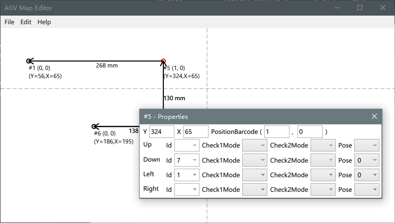

# AGV Map Editor

毕设项目，其中 Editor/ 是软件本身的源码，Report/ 是报告源码。

## 编译

由于使用了 C# 7.0，请使用 VS 2017 或以上进行编译。

## 操作方法

行为|功能
:---|:---
单击|选中/拖动
双击|创建新点/打开属性窗口
按住 <kbd>Ctrl</kbd>|不自动对齐到其他点
按住右键|拖动画布/创建箭头

## License

[Good Luck With That Public License](https://github.com/me-shaon/GLWTPL).
